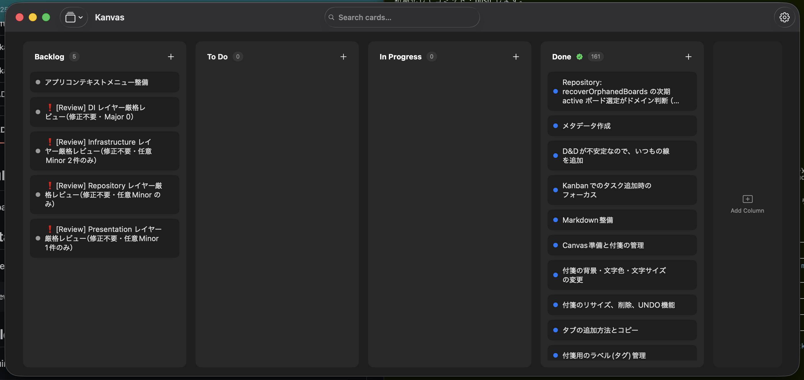
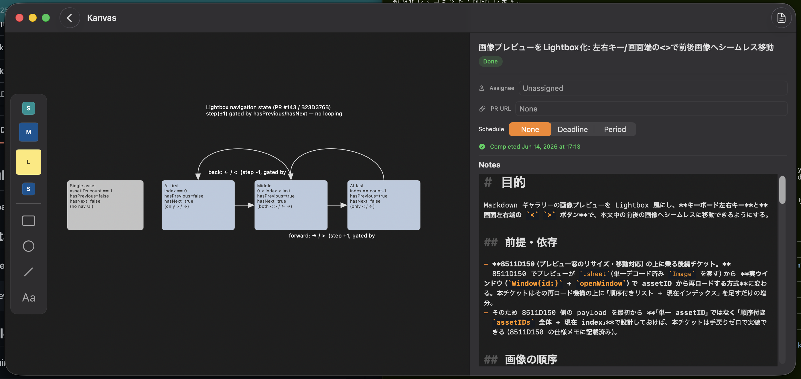

# Kanvas

A Kanban-first task manager for macOS where **every ticket carries its own
spatial canvas and Markdown detail**. Track work on a Kanban board, then drill
into any card to lay out the thinking behind it — visually on a canvas and in
prose in Markdown.

## What it does

Manage tickets on a Kanban board:



Select any card to drill down into that ticket's workspace — a free-form
**canvas** on the left and a **Markdown** detail pane on the right:



- **Kanban board** — columns, cards, drag-and-drop, completion tracking.
- **Per-ticket canvas** — each card owns a spatial canvas of stickies (task and
  free), connectors, shapes, and text annotations. Task stickies link back to
  sub-cards on the board (promote / demote).
- **Per-ticket Markdown** — a full Markdown editor for notes, plus schedule,
  assignee, and PR link, all attached to the card.

## MCP server

Kanvas ships an MCP server (`KanvasMCP`) so a model can read and edit the same
data the app uses — through the same validation and persistence, not by editing
files directly. Each feature is exposed as a group of tools:

- `board_*` — boards, columns, and cards
- `canvas_*` — a card's stickies and the connectors between them
- `markdown_*` — a card's Markdown content and inline images

Register the server from the installed app:

```sh
claude mcp add --scope user kanvas /Applications/Kanvas.app/Contents/MacOS/KanvasMCP
```

## Install

Homebrew (cask):

```sh
brew tap s-age/kanvas
brew install --cask s-age/kanvas/kanvas
```

## Build from source

Requires the Swift 6 toolchain and macOS 15+.

```sh
swift build                   # build
swift test                    # run tests
./Scripts/build.sh --install  # assemble Kanvas.app and install to /Applications
```

## Release

```sh
./Scripts/release.sh          # signed, notarized, stapled Kanvas-<version>.dmg
```
